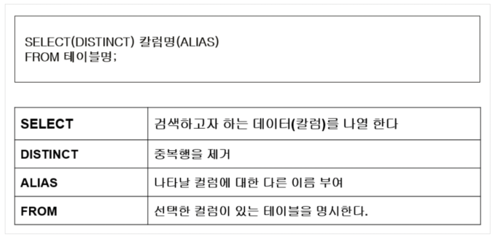
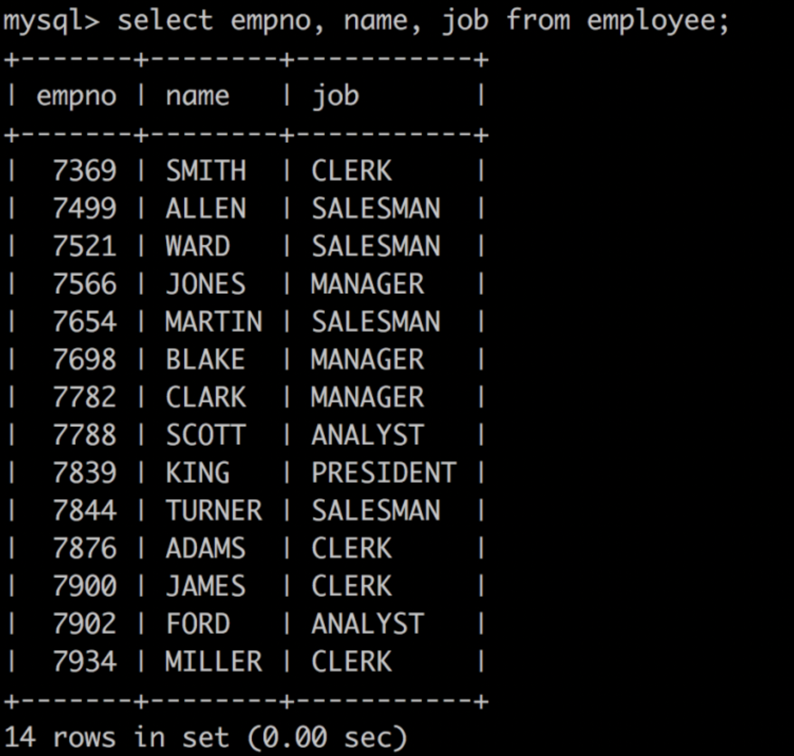
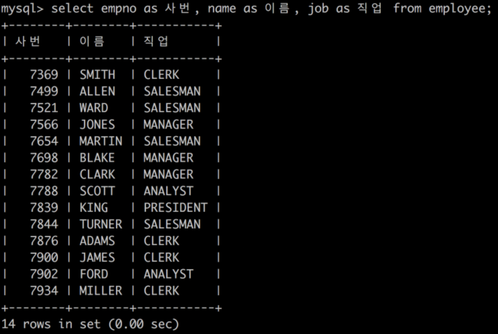
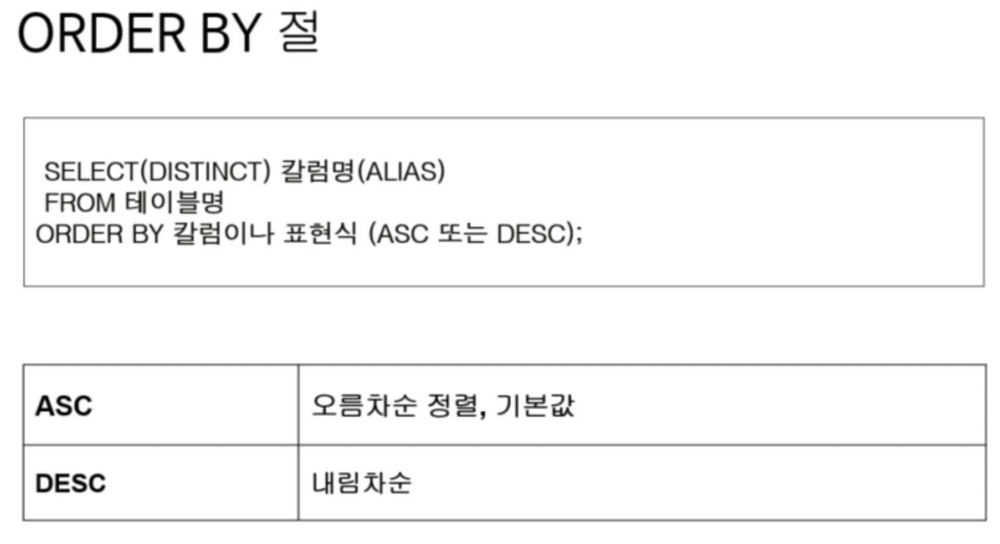

# 데이터 조작어(DML, Data Manipulation Language)

## 데이터 조작어(DML)의 종류
데이터 조작어는 모두 동사로 시작하며,  
시작하는 동사에 따라 4가지가 존재한다.  
1. SELECT - 검색
2. INSERT - 등록
3. UPDATE - 수정
4. DELETE - 삭제

## SELECT 구문의 기본형


### 예제
예제1) departments 테이블의 모든 데이터를 출력하시오.
```sql
SELECT* FROM DEPARTMENTS;
```
>여기서 *은 **전체**를 의미한다.
  
예제2) employee 테이블에서 직원의 사번(empno), 이름(name), 직업(job)을 출력하시오.
```sql
select empno, name, job from employee;
```

  
예제3) employee 테이블에서 직원의 사번(empno), 이름(name), 직업(job)을 출력하시오.
```sql
select empno as 사번, name as 이름, job as 직업 from employee;
```

>칼럼에 대한 ALIAS(별칭)을 부여하여 Heading을 변경할 수 있다.

예제4) employee 테이블에서 사번과 부서번호를 하나의 칼럼으로 출력하시오.
```sql
select concat(empno,'-',deptno) AS '사번-부서번호' from employee;
```
예제5-1) 사원 테이블의 모든 부서번호를 출력하시오.
```sql
select deptno from employee;
```
예제5-2) 사원 테이블의 부서번호를 중복되지 않게 출력하시오.
```sql
select distinct deptno from employee;
```
>위와 같이 distinct를 사용하면 중복행을 제거할 수 있다.

##SELECT 구문 정렬하기


예제6) employee 테이블에서 직원의 사번(empno), 이름(name), 직업(job)을 출력하시오.
단, 이름을 기준으로 오름차순 정렬합니다.

```sql
select empno, name, job from employee order by name;

select empno as 사번, name as 이름, job as 직업 from employee order by 이름;
```

예제7) employee 테이블에서 직원의 사번(empno), 이름(name), 직업(job)을 출력하시오.
단, 이름을 기준으로 내림차순 정렬합니다.
```sql
select empno, name, job from employee order by name desc;

select empno as 사번, name as 이름, job as 직업 from employee order by 이름 desc;
```

끝-!